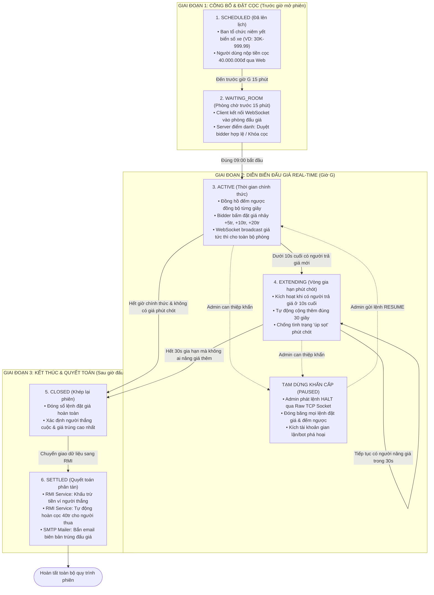
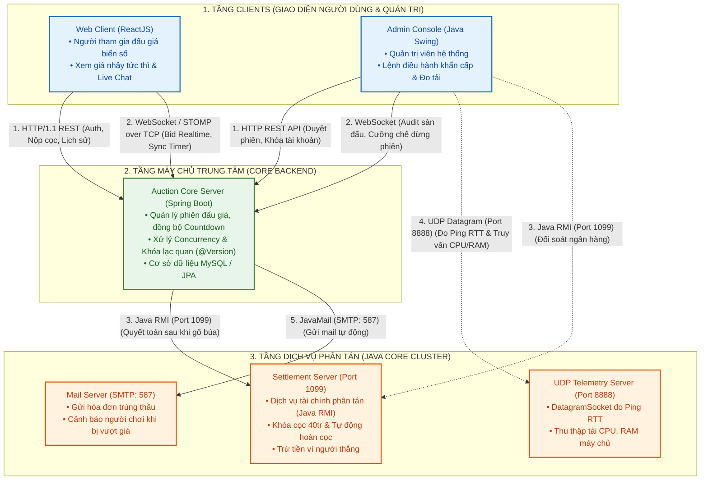

# LẬP TRÌNH MẠNG JAVA

## **1. THÔNG TIN CHUNG VÀ BỐI CẢNH ĐỀ TÀI**

### **1.1. Định nghĩa hệ thống và chức năng cốt lõi**

Hệ thống là một nền tảng đấu giá trực tuyến biển số xe ô tô, cho phép người dùng nộp cọc để vào phòng đấu giá trả giá nhảy trực tiếp theo thời gian thực (kèm chat và đếm ngược), hệ thống tự động trừ tiền người thắng và hoàn trả 100% tiền cọc cho người thua khi hết giờ, đồng thời cung cấp bảng điều khiển cho quản trị viên giám sát và can thiệp phiên.

Các chức năng nghiệp vụ trọng tâm:

1. **Nộp cọc giữ chỗ:** Đăng ký, nạp tiền ví và nộp tiền cọc (40.000.000 VNĐ) để được cấp quyền vào phòng đấu giá biển số mong muốn.
2. **Đấu giá trực tuyến thời gian thực:** Tham gia phòng đấu giá với giá nhảy tức thì, bấm các bước giá (`+5tr`, `+10tr`...), đồng bộ đồng hồ đếm ngược (hỗ trợ vòng gia hạn 30s) và trò chuyện trực tiếp.
3. **Quyết toán và hoàn cọc tự động:** Khi kết thúc phiên, hệ thống tự động khấu trừ tiền người thắng và tự động hoàn trả nguyên vẹn 100% tiền cọc cho toàn bộ người thua cuộc.
4. **Giám sát và quản trị mạng:** Cung cấp bảng điều khiển cho Admin theo dõi phòng đấu giá, đo độ trễ mạng và can thiệp tạm dừng phiên khẩn cấp khi phát hiện dấu hiệu gian lận.

### **1.2. Tính cấp thiết và cơ sở thực tiễn**

Đấu giá trực tuyến biển số xe ô tô là một trong những hệ thống công nghệ mạng có độ nhạy cảm cao nhất:

1. **Giá trị tài sản rất lớn:** Các biển số ngũ quý (`30K - 999.99`, `51K - 888.88`...) có thể đạt giá trị hàng chục tỷ đồng. Yêu cầu tính chính xác, không thất thoát tiền ký quỹ và tính toàn vẹn dữ liệu là tuyệt đối.
2. **Độ trễ thấp và tải đồng thời cao:** Hàng nghìn người tham gia cùng theo dõi và tranh đua đặt giá từng giây. Hệ thống phải đảm bảo tính tức thời (dưới 100ms) để mọi client nhận được bước giá nhảy cùng lúc.
3. **Cơ chế phòng chống gian lận và tranh chấp phút chót:** Hệ thống có cơ chế "vòng gia hạn tự động" (nếu có lượt đặt giá trong 10 giây cuối thì phiên đấu tự động cộng thêm 30 giây).

### 1.3. Tổng hợp chức năng chung

a. Chức năng cho người dùng

| **Nhóm chức năng** | **Tên chức năng chi tiết** | **Mô tả nghiệp vụ** | **Giao thức sử dụng** |
| --- | --- | --- | --- |
| **1. Quản lý Tài khoản & Ví** | • Đăng ký / Đăng nhập
• Quản lý ví tiền ảo (Balance)
• Nhận email kích hoạt / OTP | - Đăng ký tài khoản, đăng nhập nhận JWT Token.
- Xem số dư ví, nạp tiền giả lập vào ví để đủ điều kiện đặt giá.
- Nhận email xác thực hoặc thông báo bảo mật. | • **HTTP / REST** (Port 8080)
• **SMTP** (Email) |
| **2. Quản lý Sản phẩm (Người bán)** | • Đăng sản phẩm đấu giá
• Theo dõi phiên của mình | - Điền tên, mô tả, upload ảnh sản phẩm.
- Đặt giá khởi điểm, bước giá (ví dụ: +100k, +500k), thời gian bắt đầu và kết thúc.
- Xem danh sách những món đồ mình đang rao bán. | • **HTTP / REST** (Port 8080) |
| **3. Sảnh chờ & Tìm kiếm** | • Xem danh sách phiên đấu giá
• Lọc & Tìm kiếm sản phẩm | - Xem các phiên: *Sắp diễn ra*, *Đang diễn ra*, *Đã kết thúc*.
- Tìm kiếm theo tên hàng hóa, danh mục (Đồ điện tử, Trang sức...). | • **HTTP / REST** (Port 8080) |
| **4. Phòng Đấu Giá Trực Tiếp (Core)** | • **Đồng hồ đếm ngược Real-time**
• **Đặt giá (Bidding)**
• **Bảng nhảy giá trực tiếp (Live Feed)**
• **Luật gõ búa & Chống bắn tỉa** | - Vào phòng đấu giá trực tiếp xem đồng hồ đếm ngược từng giây.
- Bấm nút trả giá (+1 bước giá, +2 bước giá).
- Khi có người trả giá mới: Màn hình của tất cả người trong phòng lập tức cập nhật giá mới và tên người dẫn đầu.
- **Chống bắn tỉa (Sniper Protection):** Nếu có ai bid ở 15 giây cuối, đồng hồ tự động cộng thêm 15 giây để người khác kịp phản hồi.
- Âm thanh: Tiếng chuông gõ búa khi có giá mới / sắp hết giờ. | • **WebSocket / STOMP** (Port 8080) |
| **5. Giám sát Mạng & Kết nối** | • Xem cột sóng độ trễ (Ping)
• Tự động kết nối lại khi rớt mạng | - Hiển thị Ping RTT góc màn hình: *Xanh (<50ms), Vàng (<150ms), Đỏ (>300ms)*.
- Nếu mất mạng WiFi: Màn hình báo "Đang kết nối lại...", tự động reconnect theo thuật toán Exponential Backoff mà không cần bấm F5. | • **UDP Datagram** (Port 8888)
• **WebSocket Reconnect** |
| **6. Kết thúc phiên & Hóa đơn** | • Thông báo trúng đấu giá
• Nhận hóa đơn qua Email | - Khi đếm về 0s: Màn hình chúc mừng người trả giá cao nhất.
- Hệ thống tự động gửi Email hóa đơn xác nhận trúng thầu về hòm thư Gmail của người thắng. | • **WebSocket** (Port 8080)
• **SMTP** (Email) |

b. Chức năng cho quản trị viên

| **hóm chức năng** | **Tên chức năng chi tiết** | **Mô tả nghiệp vụ** | **Giao thức sử dụng** |
| --- | --- | --- | --- |
| **1. Quản trị Nghiệp vụ (Web Admin)** | • Quản lý người dùng
• Duyệt / Hủy phiên đấu giá
• Thống kê doanh thu | - Xem danh sách thành viên, khóa tài khoản vi phạm.
- Duyệt các sản phẩm do người bán đăng lên trước khi mở phiên.
- Xem báo cáo tổng số phiên thành công, tổng tiền giao dịch. | • **HTTP / REST** (Port 8080) |
| **2. Giám sát Sức khỏe Máy chủ** | • **Theo dõi tải phần cứng (Metrics)** | - Theo dõi các chỉ số máy chủ theo thời gian thực: *% CPU đang chạy, dung lượng RAM sử dụng, số lượng người đang online, số lượt bid/giây*.
- Đảm bảo server không bị nghẽn mạng khi giờ G đến. | • **UDP Socket** (Port 8888)
*(Gói tin nhẹ, không làm chậm Server)* |
| **3. Can thiệp Khẩn cấp (Emergency Control)** | • **Lệnh Dừng khẩn cấp (`HALT`)**
• **Lệnh Tiếp tục (`RESUME`)**
• **Lệnh Đuổi tài khoản (`KICK`)**
• **Lệnh Hủy phiên (`CANCEL`)** | Dành riêng cho tình huống sàn bị bot spam giá, hacker phá hoại hoặc server quá tải, Admin dùng tool gõ lệnh thẳng qua cổng TCP:
- `HALT <id>`: Đóng băng ngay lập tức phiên đấu giá, vô hiệu hóa nút bid của người dùng.
- `RESUME <id>`: Mở lại phiên, cộng thêm 30s để người chơi chuẩn bị.
- `KICK <userId>`: Cưỡng chế ngắt kết nối WebSocket của tài khoản gian lận ra khỏi phòng.
- `CANCEL <id>`: Hủy phiên và kích hoạt hoàn tiền cọc. | • **Raw TCP Socket** (Port 9090)
*(Kênh độc lập, không sợ bị nghẽn Web)* |

## **2. ĐẶC TẢ SẢN PHẨM VÀ NGHIỆP VỤ BIỂN SỐ XE**

### **2.1. Cấu trúc thông tin Biển số xe đấu giá**

Mỗi đối tượng biển số xe trong hệ thống được quản lý với các thuộc tính:

- **Mã biển số:** Ví dụ `30K - 999.99` (Hà Nội), `51L - 888.88` (TP. Hồ Chí Minh), `43A - 567.89` (Đà Nẵng).
- **Tỉnh / Thành phố:** Mã vùng (29/30, 51, 43, 14, 15...).
- **Loại phương tiện:** Ô tô con, Ôtô tải, Xe bán tải.
- **Phân loại sưu tầm / phong thủy:** Ngũ quý (99999, 88888), Tứ quý, Tam hoa, Sảnh tiến (56789), Lộc phát (6868), Thần tài (7979).

### **2.2. Quy chuẩn tài chính & Phiên đấu giá**

- **Giá khởi điểm:** Cố định `40.000.000 VNĐ` / biển số (theo quy định nhà nước).
- **Tiền đặt trước:** `40.000.000 VNĐ`. Người tham gia bắt buộc phải khóa số dư cọc trước giờ mở phiên. Nếu thua cuộc, tiền cọc được giải phóng hoàn lại 100%.
- **Bước giá tối thiể:** `5.000.000 VNĐ` / bước. Người tham gia có thể chọn tăng nhanh: +5 triệu, +10 triệu, +20 triệu, +50 triệu hoặc nhập mức giá hợp lệ (bội số của 5 triệu).
- **Thời gian phiên:** Thường cấu hình từ 30 - 60 phút (môi trường dem: 3 - 5 phút).

## **3. QUY CHUẨN NGHIỆP VỤ PHIÊN ĐẤU GIÁ**

### **3.1. Các trạng thái phiên đấu giá**

### **3.2. Phân quyền người dùng trong phòng đấu giá**

Khi người dùng truy cập vào một phòng đấu giá, hệ thống kiểm tra số dư cọc để phân tách làm 2 vai trò:

1. **Đấu giá viên chính thức:**
    - Điều kiện: Đã nộp đủ `40.000.000 VNĐ` tiền đặt trước trước giờ mở phiên.
    - Quyền hạn: Được bấm các nút trả giá (`+5tr`, `+10tr`, `+20tr`), gửi tin nhắn chat, nhận thông báo tức thời.
2. **Khách theo dõi:**
    - Điều kiện: Chưa nộp cọc hoặc người dùng vãng lai.
    - Quyền hạn: Chỉ xem giá nhảy, xem đồng hồ đếm ngược và đọc chat; toàn bộ nút bấm đặt giá bị vô hiệu hóa.

### **3.3. Quy tắc đặt giá hợp lệ**

- **Mức giá đầu tiên:** Tối thiểu bằng giá khởi điểm (40.000.000 VNĐ).
- **Công thức bước giá nhảy:** mới = hiện_tại + k * 5.000.000 .
- **Chống tự đè giá:** Người đang nắm giữ mức giá cao nhất hiện tại không được phép bấm đặt giá tiếp.
- **Nguồn chân lý thời gian:** Lệnh đặt giá được đóng dấu thời gian tại thời điểm gói tin đến bộ đệm socket của Server, loại bỏ hoàn toàn gian lận chỉnh đồng hồ trên máy client.

### **3.4. Cơ chế vòng gia hạn tự động**

- Nếu trong **10 giây cuối cùng** của phiên chính thức có lượt trả giá hợp lệ → Phiên chuyển sang trạng thái `EXTENDING` và **cộng thêm đúng 30 giây**.
- Trong 30 giây gia hạn này, nếu tiếp tục có người trả giá mới → Tiếp tục đặt lại bộ đếm 30 giây mới.
- Phiên đấu giá chỉ chính thức khép lại khi **hết trọn vẹn 30 giây mà không còn ai trả giá thêm**.

### **3.5. Xử lý các kịch bản kết thúc phiên**

1. **Chuẩn thành công:** Người trả giá cao nhất khi hết giờ trúng đấu giá → RMI khấu trừ tiền, hoàn cọc người thua, SMTP gửi email biên bản.
2. **Không ai trả giá:** Hết giờ không ai trả giá → Phiên không thành, chuyển biển số về kho, hoàn lại 100% tiền cọc 40tr.
3. **Chỉ 1 người trả giá:** Người đó trúng đấu giá theo đúng quy định Nghị định 39/2023.
4. **Tranh chấp cùng bấm giá:** Xử lý theo cơ chế **First-Come, First-Served** qua hàng đợi đồng bộ tại server.

## **4. BỐN PHÂN HỆ NGHIỆP VỤ CỐT LÕI**

| **Phân hệ** | **Thành phần** | **Trách nhiệm chính** |
| --- | --- | --- |
| **Phân hệ 1** | **Cổng thông tin biển số xe** | • Đăng ký / Đăng nhập / Nạp tiền vào ví cá nhân.
• Tìm kiếm, lọc biển số: theo tỉnh/thành (Hà Nội, TP.HCM...), theo loại biển (Ngũ quý, Lộc phát...).
• Đăng ký tham gia đấu giá và nộp tiền đặt trước (40 triệu). |
| **Phân hệ 2** | **Phòng đấu giá biển số Real-time** | • Hiển thị biển số xe đang đấu giá to, rõ, viền vàng nổi bật.
• Nhảy giá tức thì giữa tất cả các máy.
• Đồng hồ đếm ngược đồng bộ + Vòng gia hạn tự động 30s.
• Chat trực tuyến giữa các đấu giá viên trong phòng. |
| **Phân hệ 3** | **Thanh toán và ký quỹ phân tán** | • Khóa tiền cọc 40 triệu khi người dùng đăng ký.
• Tự động hoàn cọc 100% cho người không trúng.
• Quyết toán tiền biển số cho người thắng.
• Tích hợp dịch vụ quy đổi giá ra USD/EUR cho người xem. |
| **Phân hệ 4** | **Điều hành mạng và cảnh báo** | • App Java Swing cho Admin: Giám sát trạng thái phòng đấu giá.
• Lệnh điều hành khẩn qua TCP: Dừng phiên (HALT), Kích tài khoản gian lận (KICK).
• Đo độ trễ mạng (Ping RTT) qua UDP.
• Gửi email SMTP tự động thông báo kết quả trúng biển số. |

## **5. THÀNH PHẦN CỐT LÕI VÀ KIẾN TRÚC MẠNG**

### 5.1. Kiến trúc hệ thống

### 5.2. Các thành phần

#### **Tầng 1: Tầng Client (Giao diện người dùng)**

- **`Web Client (ReactJS)` - Dành cho người tham gia đấu giá:**
    - Giao diện web chạy trên trình duyệt của người dùng.
    - Đảm nhiệm việc đăng ký, đăng nhập, nạp tiền vào ví, duyệt danh sách biển số xe theo tỉnh thành/loại biển (Ngũ quý, Lộc phát...) và nộp khoản tiền cọc 40.000.000 VNĐ.
    - Khi vào phòng đấu giá: Kết nối WebSocket để nhận dữ liệu giá nhảy từng giây, bấm các nút trả giá (`+5tr`, `+10tr`...), xem đồng hồ đếm ngược và tham gia Live Chat.
- **`Admin Console (Java Swing)` - Dành cho Quản trị viên:**
    - Ứng dụng Desktop thuần Java, chạy độc lập không phụ thuộc vào trình duyệt web.
    - Cung cấp bảng điều khiển để giám sát các phòng đấu giá đang diễn ra, xem biểu đồ tải CPU/RAM của server, đo Ping mạng.
    - Cho phép Admin can thiệp tức thì bằng các nút bấm: **Tạm dừng phiên** khi có tranh chấp mạng hoặc **Kích tài khoản** nếu phát hiện công cụ tự động (BOT/Spam).

#### **Tầng 2: Tầng Web Và Real-Time Hub (Spring Boot / Tomcat)**

- **`Spring Web / REST Controller` (Cổng Web API - Port 8080):**
    - Tiếp nhận các HTTP Request từ Web Client: xử lý form đăng ký/đăng nhập, mã hóa mật khẩu, cấp phiên làm việc (Session/Token).
    - Cung cấp các REST API tra cứu danh mục biển số và cập nhật số dư ví thông qua kết nối JDBC MySQL.
- **`WebSocket Bidding Hub` (Trung tâm Đấu giá Thời gian thực):**
    - Duy trì kết nối hai chiều (Full-duplex persistent connection) với tất cả các máy client đang ở trong phòng đấu giá.
    - Tiếp nhận các lệnh đặt giá của bidder, thực hiện khóa đồng bộ đa luồng (Synchronized/Lock) để xử lý chống xung đột (Race Condition); ngay lập tức **broadcast** mức giá mới nhất và đồng bộ thời gian đếm ngược (kèm vòng gia hạn 30s) đến tất cả client trong phòng mà không cần tải lại trang.

#### **Tầng 3: Tầng Dịch vụ Phân tán**

- **`TCP Control Server` (Máy chủ Điều hành - Port 9090):**
    - Lập trình socket hướng kết nối bằng `java.net.ServerSocke`
    - Chạy trên một cổng mạng riêng biệt dành cho Admin Swing Console, tách hoàn toàn khỏi luồng mạng Web thông thường.
    - Đảm bảo khi trang Web bị quá tải hoặc nghẽn mạng thì luồng byte TCP stream của Admin vẫn thông suốt để phát lệnh khẩn cấp can thiệp vào WebSocket Hub.
- **`RMI Settlement Server` (Máy chủ Quyết toán Phân tán - Port 1099):**
    - Lập trình phân tán bằng **Java RMI**
    - Đóng vai trò như một hệ thống "Core Banking" thu nhỏ chạy trên một tiến trình Java độc lập:
        1. Khóa tạm tính 40 triệu cọc trong ví người dùng khi đăng ký tham gia phiên.
        2. Khi phiên kết thúc, WebSocket Hub gọi hàm từ xa `finalizeAuction(...)` qua RMI để khấu trừ tiền của người thắng.
        3. Tự động hoàn trả 100% tiền cọc cho tất cả những người đấu giá thua cuộc.
- **`UDP Telemetry Server` (Máy chủ Đo lường Hạ tầng - Port 8888):**
    - Lập trình socket không kết nối bằng `java.net.DatagramSocket` và `DatagramPacket`
    - Tiếp nhận các gói tin Ping kích thước siêu nhỏ (64 bytes) từ client, lập tức gửi phản hồi (Echo) ngược lại để client tính toán độ trễ Round-Trip Time (RTT).
    - Định kỳ đo đạc chỉ số tải CPU, dung lượng RAM khả dụng và số lượng socket đang mở để cung cấp dữ liệu giám sát cho Admin Swing.
- **`SMTP Mailer Service` (Dịch vụ Gửi thư Tự động - Port 587/25):**
    - Cài đặt theo giao thức tầng ứng dụng tiêu chuẩn **SMTP**
    - Tự động soạn thảo và gửi email:
        - Thông báo kích hoạt tài khoản.
        - Cảnh báo khi bị người khác trả giá cao hơn (*Outbid Alert*).
        - Gửi **Giấy xác nhận trúng đấu giá biển số xe** kèm mã hóa đơn điện tử cho người thắng cuộc sau khi RMI Server hoàn tất thanh toán.

#### **Tầng 4: Tầng Dữ liệu (Data Persistence Layer)**

- **`CSDL MySQL` (Port 3306 - Kết nối qua JDBC):**
    - Quản lý toàn bộ cấu trúc bảng dữ liệu (dự kiến):
        - `tbl_license_plate`: Biển số, tỉnh thành, loại xe, kiểu số (ngũ quý, lộc phát...), giá khởi điểm 40 triệu.
        - `tbl_user`: Tài khoản, mật khẩu, CCCD, thông tin liên hệ.
        - `tbl_wallet` & `tbl_transaction`: Số dư ví, lịch sử khóa cọc, hoàn cọc.
        - `tbl_auction_session`: Trạng thái phiên (Scheduled, Active, Extending, Closed, Settled).
        - `tbl_bid_history`: Lịch sử từng bước giá nhảy (giá, thời gian mili-giây, ID người đặt).

### 5.3. Ý nghĩa các giao thức sử dụng

1. **`HTTP / REST` (Web ↔ Spring Web):** Giao tiếp phi trạng thái (Stateless), dùng cho các thao tác thông thường không yêu cầu real-time (đăng nhập, nạp ví, nộp cọc 40tr).
2. **`WebSocket WSS` (Web ↔ WebSocket Hub):** Kênh truyền song công liên tục (Stateful Full-duplex), giữ kết nối cố định để đẩy giá nhảy và chat real-time với độ trễ mili-giây.
3. **`Raw TCP Socket` (Admin Swing ↔TCP Control Server):** Kênh truyền hướng luồng tin cậy mức byte, chuyên biệt để bắn các lệnh can thiệp hệ thống khẩn cấp.
4. **`UDP Datagram` (Client/Admin ↔ UDP Server):** Kênh truyền không bắt tay siêu nhẹ, truyền nhanh mà không tốn tài nguyên, dùng để đo Ping RTT và giám sát tải.
5. **`Java RMI` (WebSocket Hub ↔ RMI Settlement):** Gọi thủ tục từ xa nội bộ giữa các service Java; truyền đối tượng dữ liệu qua cơ chế Java Serialization, giúp phân tách bài toán thời gian thực và bài toán tiền tệ an toàn.
6. **`JDBC Driver` (Spring Web / RMI ↔ MySQL):** Giao thức kết nối cơ sở dữ liệu quan hệ chuẩn trong Java.

## 6. Kiến trúc báo cáo chuẩn

assignment-network-project/
├── [INSTRUCTION.md](http://instruction.md/)               # Hướng dẫn của giảng viên (giữ nguyên, không sửa)
├── [README.md](http://readme.md/)                    # Tài liệu báo cáo chính của nhóm
│
├── statics/                     # Tài nguyên & hình ảnh báo cáo
│   ├── logo.png                 # Logo hệ thống
│   ├── diagram.png              # Sơ đồ kiến trúc mạng
│   └── result.png               # Ảnh chụp kết quả demo đấu giá
│
└── source/                      # Toàn bộ mã nguồn dự án
├── .gitignore
│
├── client/                  # Ứng dụng phía người dùng (Giao diện)
│   ├── [README.md](http://readme.md/)            # Hướng dẫn cài đặt & chạy client
│   └── (mã nguồn giao diện: trang chủ, phòng đấu giá, chat, bảng admin...)
│
├── server/                  # Ứng dụng phía máy chủ (Backend & Mạng)
│   ├── [README.md](http://readme.md/)            # Hướng dẫn cài đặt & chạy server
│   └── (mã nguồn máy chủ: API, WebSocket nhảy giá, Socket TCP/UDP, xử lý cọc...)
│
└── db/                      # (Tùy chọn) Cơ sở dữ liệu
└── schema.sql           # Script khởi tạo bảng dữ liệu (biển số, ví cọc, phiên...)

## 7. Phân chia công việc

| **Thành viên** | **Giao thức mạng chịu trách nhiệm** | **Nhiệm vụ kỹ thuật mạng cụ thể (Để trả lời vấn đáp)** |
| --- | --- | --- |
| **1. Nam** | **• WebSocket Server Broker**
**• HTTP Server (REST API) 
• RMI (Port 1099)** | - Lập trình Server mở kênh WebSocket trên nền TCP (Port 8080).
- Quản lý hàng đợi tin nhắn, broadcast dữ liệu cho nhiều client cùng lúc.
- Thiết kế đặc tả RESTful API, bảo mật JWT.
- Gọi hàm chốt phiên, hoàn cọc. |
| **2. An** | **• WebSocket / STOMP Client**
**• Thuật toán mạng (NTP & Reconnect)** | - **Lập trình khung tin STOMP:** Tự cấu hình và xử lý các Frame mạng (`CONNECT`, `SUBSCRIBE`, `SEND`, `HEARTBEAT`).
- **Thuật toán bù trừ độ trễ mạng (NTP Sync):** Tính toán độ trễ RTT để đồng bộ đồng hồ đếm ngược với Server.
- **Xử lý rớt mạng:** Viết cơ chế **Auto-Reconnect với Exponential Backoff** (tự thử lại sau 1s, 2s, 4s...).
- Tạo giao diện người dùng với ReactJS |
| **3. Bảo** | **• Raw TCP Socket (Port 9090)**
**• UDP Metrics Server (Port 8888)**
**• SMTP Mail Protocol** | - Lập trình `ServerSocket` TCP thuần: đọc luồng byte stream nhận lệnh khẩn (`HALT`, `RESUME`, `KICK`).
- Lập trình `DatagramSocket` UDP trên server: phản hồi gói tin đo CPU/RAM.
- Lập trình Admin Console gửi lệnh qua TCP 9090.
- Lập trình gửi email tự động qua giao thức SMTP.
- Tạo giao diện trang admin với Swing/pa |